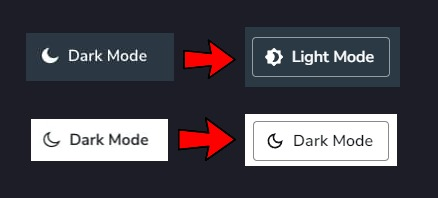
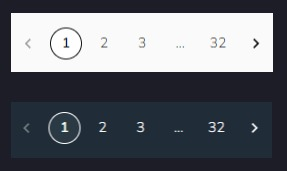
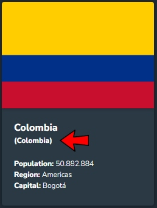

# Bia Challenge

This project is a web application developed using modern technologies like React.js, Next.js, Typescript, MUI (Material-UI), and Vitest. It features a robust testing suite with unit tests covering 92% of the codebase.

🔹 Live Demo: You can explore the demo [here](https://br3y1n.github.io/bia-challenge/)

# Observations

## 1. Filtering by Country Name and Regions

The application offers the functionality to filter countries by name and regions. However, due to limitations in the API used (https://restcountries.com/v3.1), only one filter can be applied at a time. As a result, the filtering by country name takes precedence as the primary filter.

- ### Country Name Filter

The country name filter consumes the API at https://restcountries.com/v3.1/name to retrieve countries that match the name entered by the user. When a user types the name of a country in the search field, the application displays the countries that match the input. This feature allows users to quickly search for specific countries and access detailed information about them.

- ### Regions Filter

For filtering by regions, a dropdown menu (select) was implemented, pre-populated with regions from countries that match the country name filter. When a user selects a region from the dropdown menu, the application filters the countries already filtered by name according to the selected region, showing only countries belonging to that specific region.

It's important to note that due to API limitations, filtering by name and region is performed independently, and it is not possible to combine both filters into a single API request.

## 2. Changes in Dark Mode Button

The initial design of the Dark Mode button was not intuitive enough for users, prompting a change to enhance the user experience. The button now toggles between a moon (dark mode) and a sun (light mode) icon, clearly indicating its functionality. Additionally, the button text has been updated to display "Dark Mode" in light mode and "Light Mode" in dark mode, providing users with a quick understanding of the current interface state.



## 3. Pagination in the Country List

To enhance performance, pagination was implemented for the country list. Prior to this change, displaying all countries on a single page could lead to inefficient loading, especially on devices with limited resources. With pagination, a reasonable number of countries are loaded per page, reducing resource overload and improving overall loading speed.

Pagination allows users to navigate the country list more fluidly and efficiently, resulting in reduced loading times. This significantly enhances the user experience, particularly in situations with slow or unstable internet connections.



## 4. Changes in Country Card

The country card component has been enhanced to display additional information when the country name filter is applied. When a user searches for a country, the card now shows the country name along with the matched name (either from "name" or "altSpelling") in parentheses. This provides transparency to users, indicating why certain countries are included in the filtered results.



These implemented changes and filters were designed to provide users with an enhanced experience when searching and exploring country information while optimizing application efficiency and performance.

# Requirements

Before starting, ensure you meet one of the following paths to run the application:

## Option 1: Using Docker (Recommended)

1. Ensure Docker is installed on your system. If you don't have Docker, you can download and install it from the following link: [Docker](https://www.docker.com/get-started).

2. Clone this repository on your local machine:

```bash
git clone https://github.com/br3y1n/bia-challenge.git
cd bia-challenge
```

3. Run Docker Compose to build and start the development environment:

```bash
docker-compose up
```

Once the container is running, you can access the application at http://localhost:3000.

## Option 2: Without Docker

1. Ensure Node.js version 22 or higher is installed on your system. You can download Node.js from the following link: [Node.js](https://nodejs.org/es)

2. Clone this repository on your local machine:

```bash
git clone https://github.com/br3y1n/bia-challenge.git
cd bia-challenge
```

3. Install dependencies using Yarn:

```bash
yarn install
```

4. For development, run:

```bash
yarn launch:api
```

The application will be available at http://localhost:3000.

5. For production, first build the project, then run the application:

```bash
yarn sync:envs --withCountryTarget=api && yarn build && yarn start
```

The application will be available at http://localhost:3000.

# 🏗️ Launch Options

## 🧩 Mock Data Mode (Recommended for development)

```bash
yarn launch
```

- Automatically configures environment variables
- Uses local mock data for all features
- No external dependencies needed
- Includes simulated network delay (200ms)

## 🌐 API Data Mode

```bash
yarn launch:api
```

- Starts:
  - Next.js development server
- Connects to:
  - Restcountries API
- Requires internet connection

# 🌍 Environment Configuration

The application automatically handles environment setup with launch command, but you can customize these variables:

```env
# API Endpoints
NEXT_PUBLIC_COUNTRY_API=https://restcountries.com/v3.1

# Data Sources (api | mock)
NEXT_PUBLIC_COUNTRY_TARGET=mock

# Network Settings
NEXT_PUBLIC_NUMBER_RETRIES_REQUEST=2      # API retry attempts
NEXT_PUBLIC_MOCK_DELAY_RESPONSE_MS=200    # Mock response delay
```

# 🛠️ Development Tools

| Command            | Description                 |
| ------------------ | --------------------------- |
| `yarn dev`         | Standard Next.js dev server |
| `yarn build`       | Create production build     |
| `yarn start`       | Run production build        |
| `yarn test`        | Run Vitest tests            |
| `yarn lint`        | Run ESLint checks           |
| `yarn check-types` | TypeScript validation       |

# ✅ Best Practices

✔️ **Automatic Environment Setup** - No manual .env configuration needed  
✔️ **Clean Architecture** - Separated concerns with feature modules  
✔️ **Type Safety** - Full TypeScript integration  
✔️ **Adaptive Data Layer** - Switch between mock/API without code changes  
✔️ **Network Resilience** - Configurable retry logic for API calls  
✔️ **Realistic Mocks** - Simulated network delays for development

# Unit Tests

The project includes unit tests written with Jest to ensure stability and proper functionality of the components. To run the tests, follow these steps:

```bash
yarn test
```

This command will execute the tests and display the results, including the code coverage percentage.

# Technologies Used

This project utilizes the following technologies:

- [React.js](https://reactjs.org/)
- [Next.js](https://nextjs.org/)
- [Typescript](https://www.typescriptlang.org/)
- [Mui](https://mui.com/)
- [Vitest](https://vitest.dev/)

Thank you for your interest in this project! If you have any questions or suggestions, please feel free to reach out. Enjoy developing with Next.js and modern technologies!
